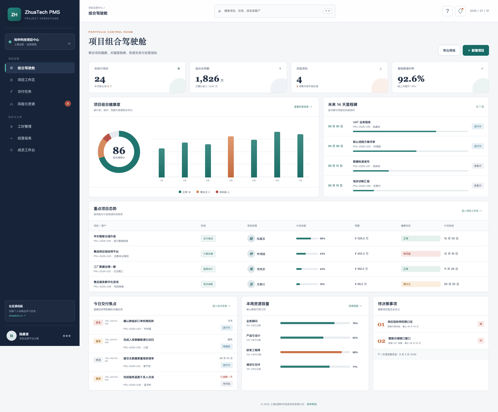
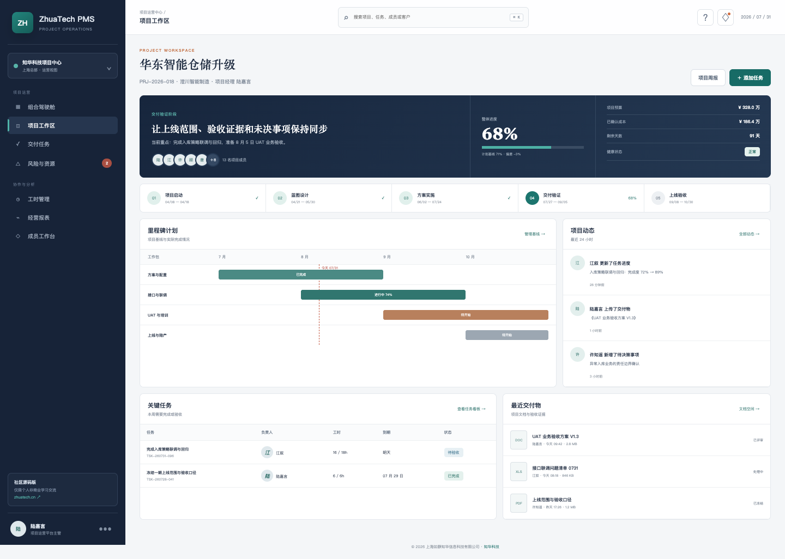
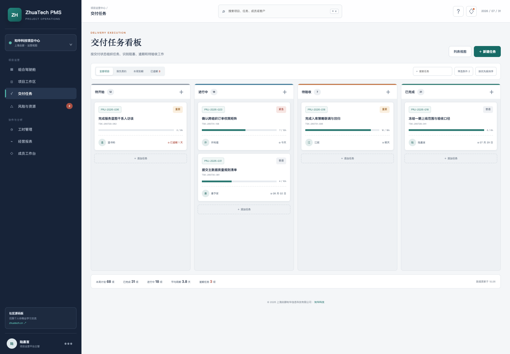
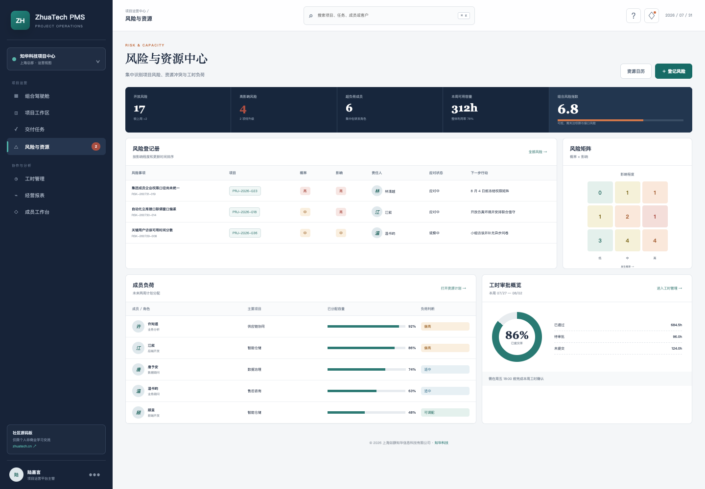
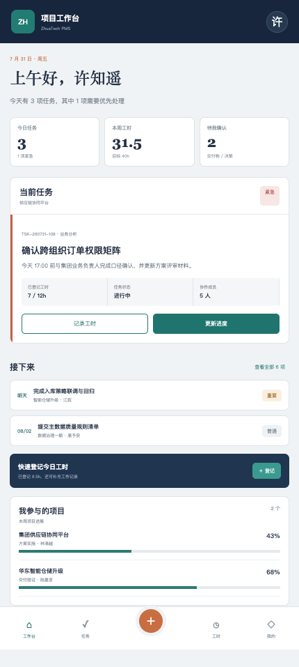

<p align="center">
  <strong>ZhuaTech PMS</strong><br>
  知华科技 · 企业项目管理系统社区源码版
</p>

<p align="center">项目组合 · 计划里程碑 · 交付任务 · 风险资源 · 工时协同 · 成员 H5</p>

> 本项目由 **知华科技（上海如静知华信息科技有限公司）** 发布，用一套可运行的前后端工程呈现企业项目从立项、计划、执行到复盘的管理闭环。

## 项目不是一张任务清单

企业项目常见的问题并非“没有计划”，而是经营目标、交付计划、任务执行、风险处置和人员工时分散在不同表格中。ZhuaTech PMS 将管理层关心的组合健康度，与项目经理维护的里程碑、任务、风险和成本放进同一工作空间；成员则通过轻量 H5 工作台处理任务与工时。

适合用于项目管理系统、PMO 平台、项目交付中台和企业协同产品的技术学习与原型验证。

## 五个真实工作界面

### 01 · 项目组合驾驶舱

管理端首页汇总项目数量、合同额、健康度、里程碑准时率、资源容量和待决策事项，便于 PMO 召开项目例会。



### 02 · 单项目工作空间

将阶段基线、预算成本、里程碑、关键任务、项目动态和交付物放在一张项目全景页中。



### 03 · 交付任务看板

按待开始、进行中、待验收和已完成组织交付任务，同时呈现优先级、负责人、截止时间和工时消耗。



### 04 · 风险与资源中心

风险登记册、概率影响矩阵、成员负荷与工时审批集中展示，帮助项目经理提前处理交付冲突。



### 05 · 项目成员 H5 工作台

移动端围绕“今天要完成什么”设计，包含当前任务、后续安排、快速工时登记和参与项目进度。

<p align="center"></p>

## 能力地图

| 管理场景 | 社区源码版已包含 | 可继续扩展 |
| --- | --- | --- |
| 项目组合 | 组合指标、项目健康、经营金额、重点项目 | 战略主题、项目群、投资组合模拟 |
| 项目计划 | 项目主数据、阶段、进度、预算、里程碑 | WBS、依赖关系、关键路径、计划基线 |
| 交付协同 | 任务看板、优先级、负责人、工时进度 | 评论、附件、订阅、自动化规则 |
| 风险管理 | 风险登记、概率、影响、责任人、应对措施 | 问题与变更、风险量化、升级机制 |
| 资源工时 | 成员负荷、工时登记、审批概览 | 技能矩阵、成本费率、容量预测 |
| 移动工作台 | 今日任务、进度更新、快速工时、项目脉搏 | 消息推送、日程、离线处理 |
| 基础能力 | JWT 登录、角色权限、Flyway、审计时间 | 多租户、SSO、数据权限、操作日志 |

## 技术基线

```text
Vue 3 + Vite 7              Spring Boot 4 + Java 21
        │                              │
        └──────── REST / JWT ──────────┘
                                       │
                                  MySQL 8.4
```

- 前端：Vue 3、Vue Router、Pinia、Axios，桌面管理端与响应式 H5。
- 后端：Java 21、Spring Boot、Spring Security、Spring Data JPA、JWT。
- 数据库：MySQL 8.4、Flyway；测试环境使用 H2。
- 部署：Docker、Docker Compose、Nginx。
- Java 工程坐标：`cn.zhuatech:zhuatech-pms-backend`。
- Java 根包：`cn.zhuatech.pms`。

## 目录导览

```text
zhuatech-pms/
├── backend/                 Java 后端、数据库迁移与集成测试
├── frontend/                Vue 管理端和成员 H5
├── docs/                    API、架构、数据库与项目截图
├── deploy/                  部署与上线检查说明
├── compose.yaml             本地容器编排
├── LICENSE                  社区源码许可
└── NOTICE                   公司与版权声明
```

## 立即运行

### Docker Compose

```bash
cp .env.example .env
# 务必修改 .env 中的数据库密码和 JWT_SECRET
docker compose up --build
```

启动后访问 `http://localhost:8090`，后端健康检查地址为 `http://localhost:8080/actuator/health`。

### 本地开发

```bash
# MySQL 中创建 zhuatech_pms 数据库，并配置环境变量后启动后端
cd backend
mvn spring-boot:run

# 新终端启动前端演示模式
cd frontend
npm install
npm run dev:demo
```

演示账号（仅用于本地样例数据）：

| 身份 | 用户名 | 密码 |
| --- | --- | --- |
| 系统管理员 | `admin` | `admin123` |
| 项目经理 | `manager` | `manager123` |
| 项目成员 | `member` | `member123` |

生产部署前必须删除演示账号、替换全部默认密码与 JWT 密钥，并按组织和项目补充数据范围权限。

## API 起点

认证成功后统一访问 `/api/pms`：

- `GET /dashboard`：项目组合指标和近期事项。
- `GET|POST /projects`：项目查询与新建立项。
- `GET|POST /tasks`：任务查询与创建。
- `PATCH /tasks/{id}/advance`：推进任务状态。
- `GET /milestones`：里程碑计划。
- `GET /risks`：风险登记册。
- `GET|POST /timesheets`：工时查询与登记。

完整字段和权限说明见 [docs/api.md](docs/api.md)。

## 使用边界与商业授权

**本工程仅能用于个人学习、技术研究和非商业交流，不得商用。** 未经上海如静知华信息科技有限公司事先书面授权，不得用于企业内部生产经营、商业交付、SaaS 服务、投标、培训收费、咨询实施、转售或其他商业场景。需要商用、深度开发或定制部署，请先取得我方书面授权。

本项目使用带有非商业限制的 **ZhuaTech Community Source License 1.0**，因此不属于 OSI 定义的开源软件；对外准确名称为“社区源码版”。请在使用前完整阅读 [LICENSE](LICENSE)。

## 关于知华科技

知华科技（上海如静知华信息科技有限公司）专注企业信息化、软件项目交付、业务系统定制和 AI 应用落地。

- 官方网站：[https://www.zhuatech.cn/](https://www.zhuatech.cn/)
- 商务方向：PMS/PMO 平台定制、ERP/MES/WMS/CRM 集成、私有化部署、企业数字化咨询
- 联系方式：访问官网，或扫描下方任一微信二维码咨询

<p align="center">
  
  &nbsp;&nbsp;&nbsp;
  
</p>

## 搜索关键词

知华科技 PMS、开源项目管理系统、Java 项目管理系统、Spring Boot PMS、Vue 项目管理平台、PMO 管理系统、项目交付系统、项目组合管理、项目工时管理、企业项目管理软件定制。

Copyright © 2026 上海如静知华信息科技有限公司

## 项目交付置信度

`POST /api/pms/delivery-confidence` 综合计划与实际进度、关键任务、里程碑延误和预算消耗，给出 0–100 交付置信分以及 `HIGH / MEDIUM / LOW` 分层。低置信项目会进入升级队列，并生成关键路径重排和干系人同步动作。

## 项目挣值健康分析

新增 `POST /api/pms/insights/earned-value-health`，使用计划价值、挣值、实际成本和完工预算计算 SPI、CPI、完工估算与预算偏差，输出 `ON_TRACK / AT_RISK / CRITICAL`。项目经理可基于统一量化口径识别进度与成本失控。
